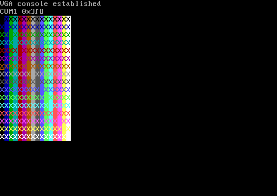
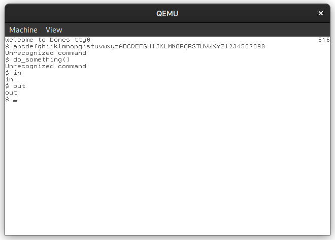
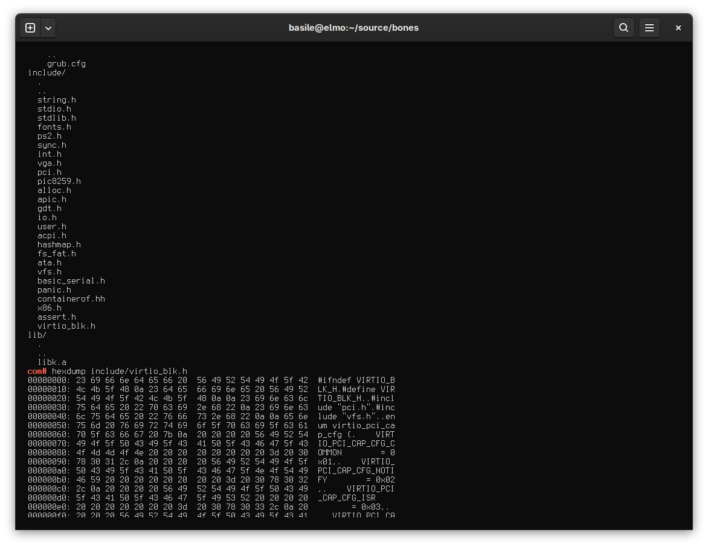

## About

Bones is a small x86 kernel I wrote using C and nasm.

## Features
 - Handwritten bootloader with ELF loader, and alternatively Multiboot2 compatible (for GRUB)
 - RS232 driver
 - PCI (not Express) 
 - virtio-blk driver over PCI
 - FAT filesystem only
 - Text-mode VGA driver
 - PS/2 keyboard driver
 - Custom C standard library (very minimal)
 - Somewhat usable command line interface (emulates GNU readline)

<!-- TODO add reading from disk screenshots or something interesting like that -->

  

    
    
    
  

  
Click to see full-size version


