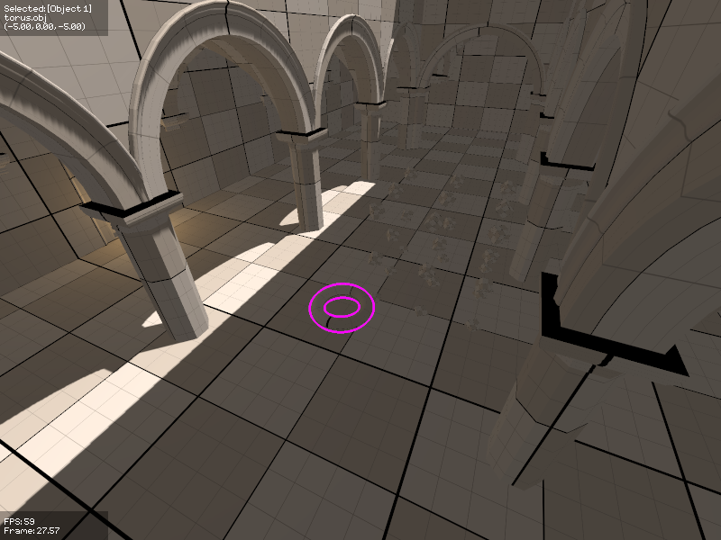

## About

Method is an OpenGL rendering engine I have been working on to learn computer
graphics. The only dependencies are SDL and glad.

The corresponding Github repository is not actively updated.

## Features
 - 3D rendering
    - Shadow mapping, CSM, PCSS
    - Post-processing (gamma correction, tonemapping, bloom)
    - Phyiscally-inspired atmospheric scattering for sky rendering based on [this](https://doi.org/10.1145/166117.166140) paper
       - Not-so-physically inspired clouds
    - Deferred decals
    - Mesh decals
    - PBR spec/gloss pipeline
    - Probe-based global illumination
        - Cubemap and spherical harmonics for specular and diffuse
    - GPU path tracing
    - Mesh CSG for blockout
 - 2D rendering
    - Texture generator
       - Perlin, Voronoi, Worley noise
       - Composition of images -- add, multiply, threshold, min/max, lerp, invert
    - Bitmap font rendering
    - Custom UI toolkit
       - Simple vertical/horizontal and fixed layouts
       - Windows, labels, buttons, text boxes, sliders, progress bars, color picker, texture embed
    - Atlas packing
    - Batched draw calls
 - In-game console
    - Console variable system
    - Autorun
    - Context-sensitive autocomplete
    - Persistent history
 - Shader preprocessor
 - Scene serialization
    - One JSON file per entity (diffable and avoids checkout conflicts)
 - CPU profiler
 - GPU profiler
 - Custom file format loaders
   - JSON parser
   - PNG image reader
   - TGA image reader and writer
   - OBJ model reader
 - Linux and Win32 support layers
   - Filesystem watching
 - Asset hot-reloading 


  

    
    
    
    
  

  
Click to see full-size version


